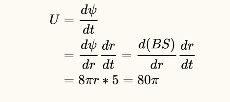
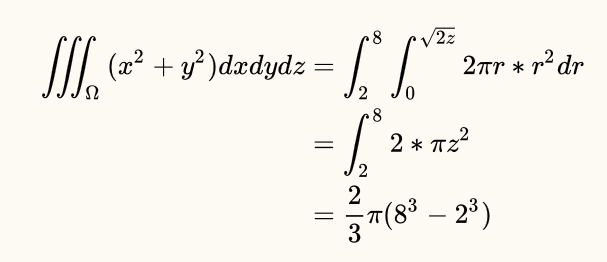

Question 0:

直接使用numpy即可求解：

```python
import  numpy as np

A = [[13627,26183,35897,48119,],
     [23027,38459,40351,19961],
     [36013,45589,17029,27823],
     [43189,12269,21587,33721]]
y = [347561292,361760202,397301762,350830412]

A = np.mat(A)
y = np.mat(np.array(y).reshape([-1,1]))
print np.dot(np.linalg.inv(A),y)
```


Question 1:

一开始猜测是等差数列结果发现并不是。然后猜测是是等间距地取了4个素数，编程发现，26364809到26366621共有112个素数，给的这三个数分别是第0、74、111个数，因此可以推断出缺失的是第37个数。

```python
import libnum

num_list = []
for i in range(26364809,26366622):
    if libnum.prime_test(i):
        num_list.append(i)

print num_list.index(26364809)
print num_list.index(26366033)
print num_list.index(26366621)
print num_list[37]
```


Question 2：

直接计算即可

Question 3:

查公式套公式



Question 4:



拼接得flag

flag{01924dd7-1e14-48d0-9d80-fa6bed9c7a00}